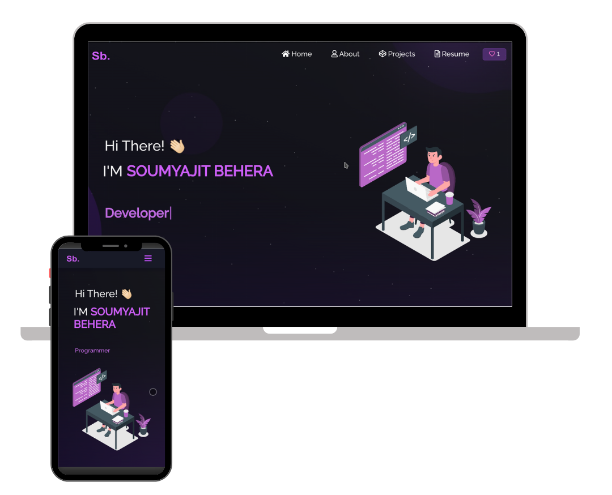

# 🚀 Jamsheer's Stellar Portfolio

## Overview
Discover the brilliance of my personal portfolio, where creativity meets technology! Explore my GitHub projects, dive into my resume, and witness a showcase of technical prowess.

## 🌟 Demo


🔗 [Check out the live version](https://soumyajit.vercel.app/)

## 🛠 Technologies Used
- React.js
- Node.js
- Express.js
- CSS3
- VsCode
- Vercel

## ✨ Features
- **Multi-Page Layout**
- **Styled with React-Bootstrap and CSS with easy to customize colors**
- **Fully Responsive**

## 🚀 Getting Started
Ready to embark on this coding journey? Clone this repository, ensure you have `node.js` and `git` installed globally, and let the exploration begin!

### 📥 Installation

```bash
npm install
```
▶️ Running the Application

```bash
npm start
```
Open http://localhost:3000 to view it in the browser. The page will reload if you make edits.

🏗 Project Structure
Unveil the architecture of the project, exploring components and layout.

🎨 Customization
Tailor the content to fit your style! Head to /src/components/ and make the portfolio truly yours.

🤝 Contributing
Contribute your brilliance! Follow our Contribution Guidelines.

📜 License
This project is licensed under the MIT License.

🙌 Acknowledgments
Special thanks to Name for the inspiration that fueled this creation.

☕ Show Your Support
If you find this website stellar, give it a ⭐️!
